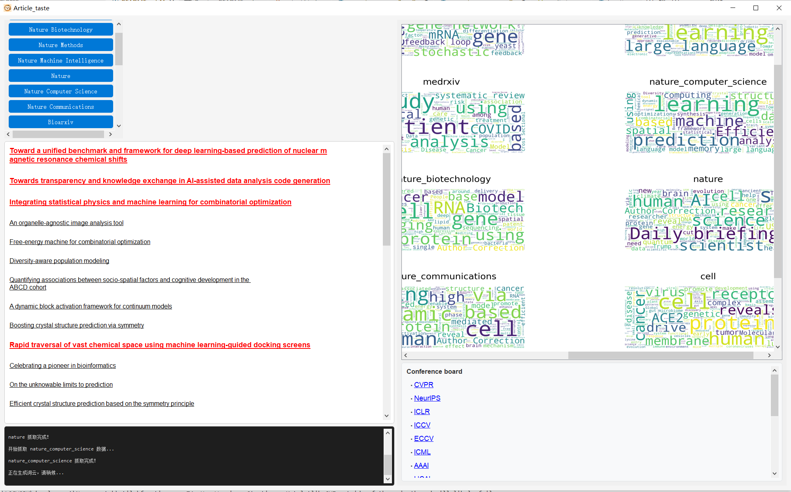

<!-- Language Switcher -->
<p align="right">
  <a href="#english-version">English</a> | <a href="#chinese-version">中文</a>
</p>

# <a id="english-version"></a>Article Taste - Scientific Paper Tracker

## Overview

Article Taste is a comprehensive desktop application intergrating with LLM for tracking and managing scientific papers across multiple platforms. this tool helps researchers stay updated with the latest publications from ArXiv, Nature journals, bioRxiv, Science, Cell, and more.


## Executable file in windows system

you can directly download this application from my personal website http://www.yifanliscience.com/Articletrack/


## Features

- 1. Monitor publications from numerous scientific platforms in one place
- 2. Papers containing your keywords of interest are automatically highlighted 
- 3. Save interesting papers to your collection for future reference, enjoying the
recommended system through three different  recommendation strategy, including key word
    other useful black gadget like Visualize citation distributions, gitHub stars, and source distributions, word cloud generation, automatically download papers containing your keywords, Search Google Scholar with customizable keywords, GitHub repository hunter.

remind:
if you want to use LLM and agent based function, please insert you own token in 
utils/api_key_config.yaml 

three types are support,i strongly recommend you to use qwen series(cheap, and fast!)(but it is very easy if you like to add another core LLM
, you just need to add function in utils/chat_engine.py, it is very easy, believe me!^^)

## Installation

### Prerequisites
- Python 3.8+
- Conda (recommended for environment management)
- Google Chrome browser (required for Science and Cell journal access)

### Setup
1. Clone the repository:
```bash
git clone https://github.com/yourusername/article_taste.git
cd article_taste
```

2. Create and activate a conda environment:
```bash
conda create -n paper_tracker python=3.8
conda activate paper_tracker
```

3. Install dependencies:
```bash
pip install -r requirements.txt
```
or
```bash
conda env create -f environment.yml
```

4. Configure Chrome:
   - Install Chrome from the [official website](https://www.google.com/chrome/)
   - Set the Chrome path via environment variable:
     - Windows: `setx CHROME_PATH "C:\Program Files\Google\Chrome\Application\chrome.exe"`
     - macOS: `export CHROME_PATH="/Applications/Google Chrome.app/Contents/MacOS/Google Chrome"`
     - Linux: `export CHROME_PATH="/usr/bin/google-chrome"`
   - Or modify the path directly in `modules/cell_series.py`

5. Run the application:
```bash
python current_app.py
```

## Usage

### Configuration

Edit the `config.json` file to customize your experience:

```json
{
  "keywords": ["machine learning", "deep learning", "reinforcement learning"],
  "conference": [
    ["CVPR 2025", "https://cvpr2025.thecvf.com/"],
    ["ICML 2025", "https://icml.cc/"]
  ]
}
```

### Main Interface

- **Left panel**: Source selection buttons for different journals and repositories
- **Center panel**: Article display area with clickable links
- **Right panel**: Visualization area and conference information
- **Bottom panel**: Debug console with real-time status updates

### Paper Browsing

1. Click on any source button (ArXiv, Nature, bioRxiv, etc.) to fetch recent papers
2. Papers containing your keywords will be highlighted in red
3. Click on any paper title to open it in your browser
4. Right-click on a paper and select "Add to favorites" to save it

### Visualizations

- **Generate Word Cloud**: Create a visual representation of frequent terms in paper titles
- **Citation Distribution**: View the distribution of citation counts among papers
- **GitHub Stars Distribution**: Analyze popularity of GitHub repositories
- **Source Distribution**: See a breakdown of papers by their sources

## Project Structure

```
├── current_app.py         # Main application file
├── config.json            # Configuration file
├── modules/               # Source-specific modules
│   ├── xiv_scrath.py      # ArXiv, bioRxiv, and medRxiv handlers
│   ├── nature_series.py   # Nature journals handlers
│   ├── science_series.py  # Science journal handler
│   ├── cell_series.py     # Cell journal handler
│   ├── others.py          # Google Scholar handler
│   └── util.py            # GitHub search utilities
├── utils/                 # Utility functions
│   ├── functions.py       # Visualization generators
│   └── utils.py           # Backup utilities
├── favorites.json         # Saved favorite papers
└── cache.json             # Cache for faster loading
```

## Contributing

Contributions are welcome! Please feel free to submit a Pull Request.

## License

This project is licensed under the MIT License - see the LICENSE file for details.

## Acknowledgments

- PyQt5 for the GUI framework
- BeautifulSoup for web scraping capabilities
- Matplotlib and WordCloud for visualization features
- [paperscraper](https://github.com/jannisborn/paperscraper) project which inspired our bioRxiv integration
- [CloudflareBypassForScraping](https://github.com/sarperavci/CloudflareBypassForScraping) library that enabled access to Science and Cell journals
- All contributors whose open-source work made this project possible

---

*Stay updated with the latest scientific research effortlessly!*

---

# <a id="chinese-version"></a>Article Taste - 科学论文追踪器

## 概述

Article Taste 是一款集成了大语言模型的综合桌面应用，专门用来追踪和管理各大平台的科学论文。有了它，你再也不用在各个网站之间跳来跳去，就能轻松掌握 ArXiv、Nature 系列期刊、bioRxiv、Science、Cell 等平台的最新动态。科研人的福音！


## Windows 系统可执行文件

懒得折腾环境？没问题！你可以直接从我的个人网站下载 Windows 版本，开箱即用：http://www.yifanliscience.com/Articletrack/

## 应用窗口



## 功能特性

- 1. **一站式监控**：把各大科学平台的论文都集中在一个地方，再也不用打开 N 个标签页了
- 2. **关键词高亮**：包含你感兴趣关键词的论文会自动标红，一眼就能看到重点（就像考试划重点一样）
- 3. **智能推荐系统**：内置三种不同的推荐策略，帮你发现那些可能被你错过的宝藏论文
- 4. **收藏功能**：看到好论文？右键收藏，再也不怕找不到了
- 5. **各种黑科技工具**：
  - 📊 可视化引用分布（看看哪些论文是真正的"网红"）
  - ⭐ GitHub 星标分布（代码仓库的人气指数）
  - 📈 来源分布统计（哪个平台最活跃一目了然）
  - ☁️ 词云生成（论文标题的高频词可视化，装逼必备）
  - 📥 自动下载包含关键词的论文（懒人福利）
  - 🔍 自定义关键词搜索 Google Scholar（想搜啥搜啥）
  - 🐙 GitHub 仓库猎人（找代码神器）

## 安装方法

### 环境要求

- Python 3.8+（太老的版本就别用了，跟不上时代）
- Conda（强烈推荐，环境管理神器）
- Google Chrome 浏览器（访问 Science 和 Cell 期刊的必备工具，没有它你就只能干瞪眼）

### 安装步骤

1. **克隆仓库**（如果你还没克隆的话）：
```bash
git clone https://github.com/yourusername/article_taste.git
cd article_taste
```

2. **创建并激活 conda 环境**（隔离环境，避免依赖冲突）：
```bash
conda create -n paper_tracker python=3.8
conda activate paper_tracker
```

3. **安装依赖**（二选一，看你的心情）：
```bash
pip install -r requirements.txt
```
或者
```bash
conda env create -f environment.yml
```

4. **配置 Chrome**（这一步很重要，别跳过）：
   - 从[官网](https://www.google.com/chrome/)下载并安装 Chrome（如果还没装的话）
   - 设置 Chrome 路径（告诉程序 Chrome 在哪里）：
     - Windows: `setx CHROME_PATH "C:\Program Files\Google\Chrome\Application\chrome.exe"`
     - macOS: `export CHROME_PATH="/Applications/Google Chrome.app/Contents/MacOS/Google Chrome"`
     - Linux: `export CHROME_PATH="/usr/bin/google-chrome"`
   - 或者直接在 `modules/cell_series.py` 里改路径（简单粗暴）

5. **运行应用**（终于到了激动人心的时刻）：
```bash
python current_app.py
```

## 使用说明

### 配置

编辑 `config.json` 文件，定制你的专属体验（就像调教 AI 一样）：

```json
{
  "keywords": ["machine learning", "deep learning", "reinforcement learning"],
  "conference": [
    ["CVPR 2025", "https://cvpr2025.thecvf.com/"],
    ["ICML 2025", "https://icml.cc/"]
  ]
}
```

### 主界面

界面布局清晰明了，不会让你找不着北：

- **左侧面板**：各种期刊和仓库的源选择按钮（想看哪个点哪个）
- **中间面板**：论文展示区，标题可以点击跳转（就像超链接一样）
- **右侧面板**：可视化区域和会议信息（数据可视化，装逼利器）
- **底部面板**：调试控制台，实时状态更新（看看程序在干什么）

### 论文浏览

使用流程简单到不能再简单：

1. 点击任一源按钮（ArXiv、Nature、bioRxiv 等），程序就会自动抓取最新论文
2. 包含你设置的关键词的论文会被红色高亮（就像 Word 里的查找高亮）
3. 点击论文标题，自动在浏览器中打开（不用手动复制粘贴了）
4. 右键论文，选择"添加到收藏"，轻松保存（再也不怕忘记论文名字了）

### 可视化功能

这些可视化工具不仅能帮你分析数据，还能让你在组会上秀一把：

- **生成词云**：把论文标题中的高频词做成漂亮的词云图（发朋友圈必备）
- **引用分布**：看看哪些论文是真正的"引用大户"（学术界的流量明星）
- **GitHub 星标分布**：分析相关代码仓库的受欢迎程度（看看哪个项目最火）
- **来源分布**：统计各来源的论文数量（哪个平台最活跃一目了然）

## 项目结构

代码结构清晰，想改哪里改哪里：

```
├── current_app.py         # 主程序文件（程序的入口）
├── config.json            # 配置文件（你的个性化设置）
├── modules/               # 各平台处理模块（不同网站的不同抓取逻辑）
│   ├── xiv_scrath.py      # ArXiv、bioRxiv、medRxiv 处理（各种 xiv 系列）
│   ├── nature_series.py   # Nature 期刊处理（顶级期刊）
│   ├── science_series.py  # Science 期刊处理（另一个顶级期刊）
│   ├── cell_series.py     # Cell 期刊处理（生物学的顶刊）
│   ├── others.py          # Google Scholar 处理（学术搜索神器）
│   └── util.py            # GitHub 搜索工具（找代码用的）
├── utils/                 # 工具函数（各种辅助功能）
│   ├── functions.py       # 可视化生成（画图用的）
│   └── utils.py           # 备份工具（防止数据丢失）
├── favorites.json         # 收藏论文（你的论文清单）
└── cache.json             # 加载缓存（加快速度）
```

## 贡献

欢迎贡献代码！如果你发现了 bug 或者有好的想法，尽管提交 Pull Request。代码质量不重要，重要的是热情（开玩笑的，代码质量也很重要）！

## 许可证

本项目采用 MIT 许可证，想怎么用就怎么用，详见 LICENSE 文件。

## 鸣谢

感谢以下开源项目和技术，没有它们就没有这个项目：

- PyQt5：图形界面框架（让程序有脸见人）
- BeautifulSoup：网页解析神器（把网页内容扒下来）
- Matplotlib 和 WordCloud：可视化工具（让数据变得好看）
- [paperscraper](https://github.com/jannisborn/paperscraper)：为 bioRxiv 集成提供了灵感（站在巨人的肩膀上）
- [CloudflareBypassForScraping](https://github.com/sarperavci/CloudflareBypassForScraping)：让访问 Science 和 Cell 期刊成为可能（绕过反爬虫的利器）
- 所有开源贡献者：感谢你们的无私奉献，让这个世界变得更美好

---

*轻松追踪最新科研动态，再也不用担心错过重要论文了！* 🎉