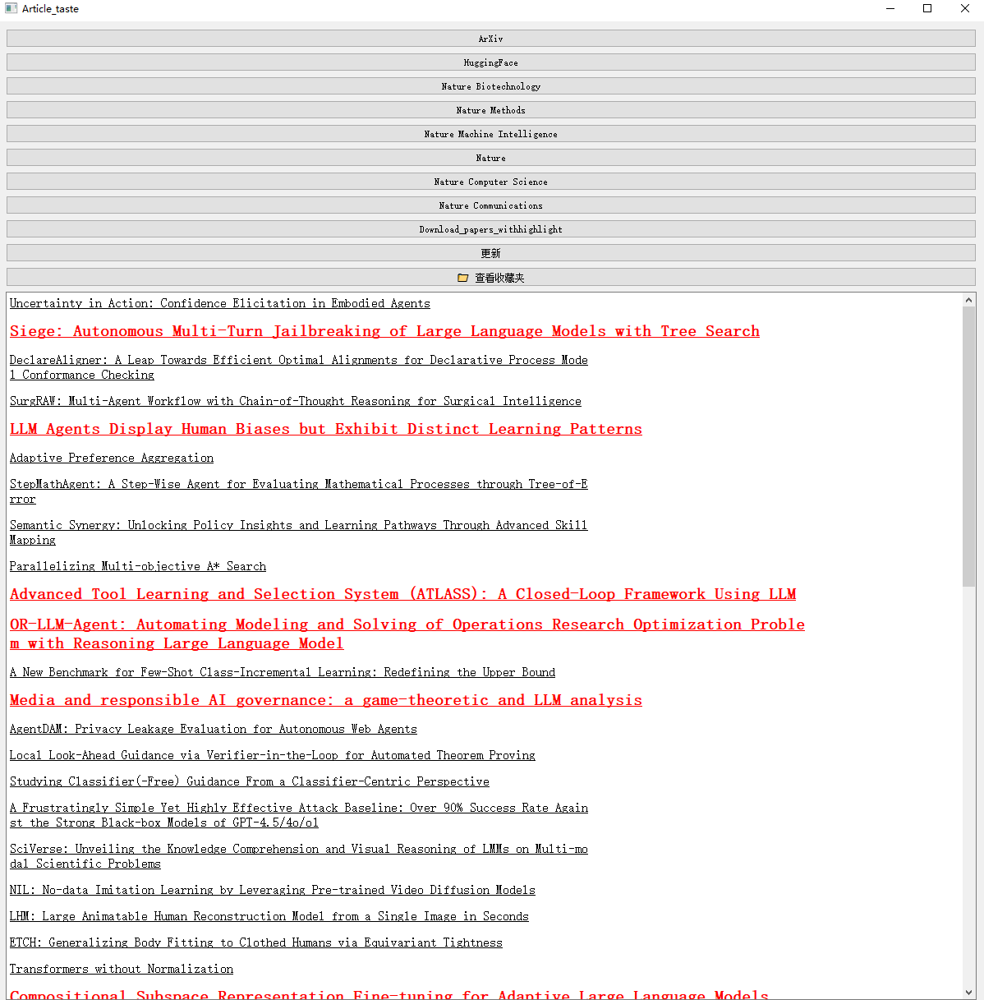

# 🤩 **Article_Taste**  
🚀 A tool for tracking and extracting research article updates from multiple journals (including ArXiv, Nature Biotechnology, BioRxiv, etc.).  In WINDOWS system!

---

## 🌟 **Project Overview**  
**Article_Taste** is a Python-based tool designed to automatically scrape the latest article titles, links, and abstracts from major journals and display the relevant content in a user-friendly interface with keyword-based highlighting.  


✨ **Key Features:**  
✅ Supports ArXiv, Nature Biotechnology, Nature, Nature Methods, Nature Machine Intelligence, BioRxiv, and more 
✅ Module design: You can add your favorite journal by setting specific code.
✅ Customizable keywords to automatically highlight relevant articles  
✅ Simple and intuitive interface for quick access to the latest research updates  

---

## 📥 **Setup Environment**  
### Open bash ###
```bash  
git clone https://github.com/Dsadd4/Article_taste
cd Article_taste
```  
### 1. Create environment  
```bash  
conda create -n Article_taste python==3.11  
conda activate Article_taste  
```  

### 2. Install dependencies  
```bash  
pip install -r requirements.txt  
```  

---

## 🚀 **Run the Tool**  
```bash  
python current_app.py  
```  

---

## 🥰 setup
In config.json set the key word you interested in


## 🎯 **Interface Overview**  
> The retrieved article list will automatically highlight relevant articles based on the specified keywords. Clicking the title will directly open the article.  

---

##  **Collaborate Developers**  
- **ChatGPT** (Collaborative Development Assistant)  

---

## 🏆 **Acknowledgments**  
Special thanks to the open-source community for inspiration and to ChatGPT for support in coding, debugging, and design. ❤️  
